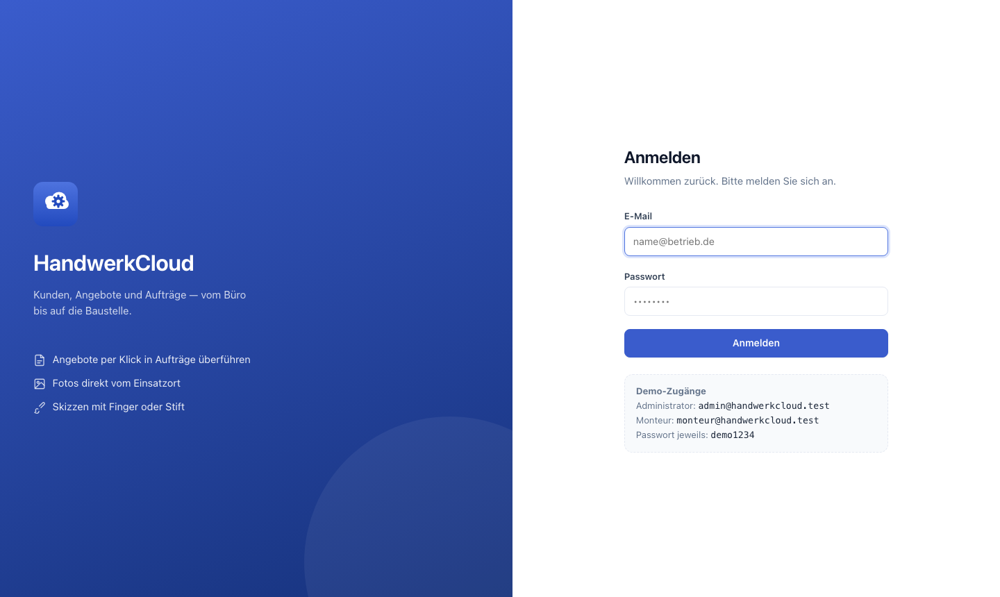
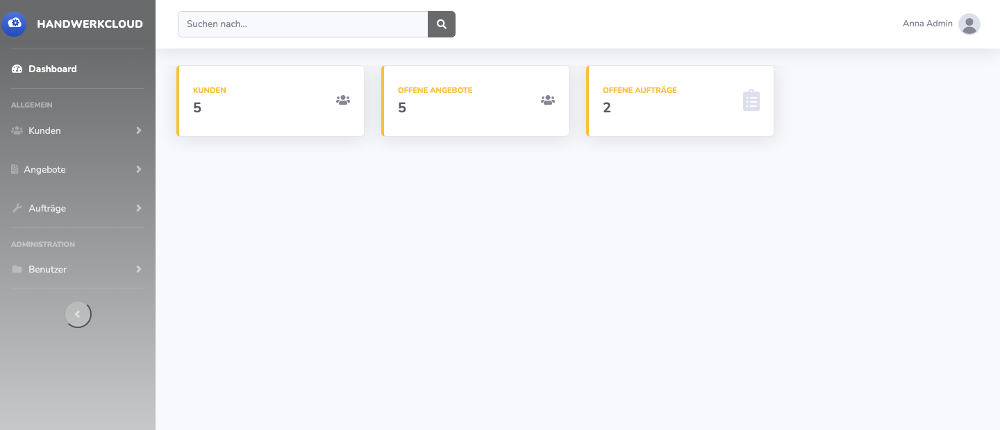
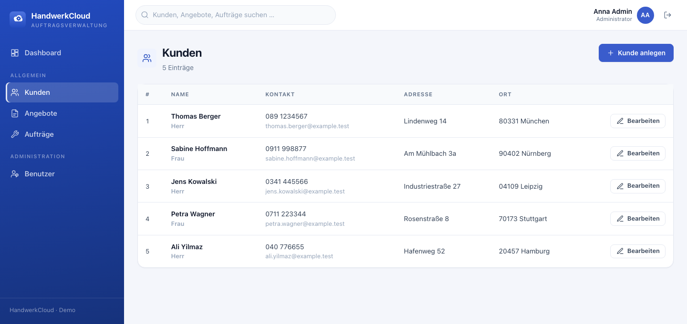
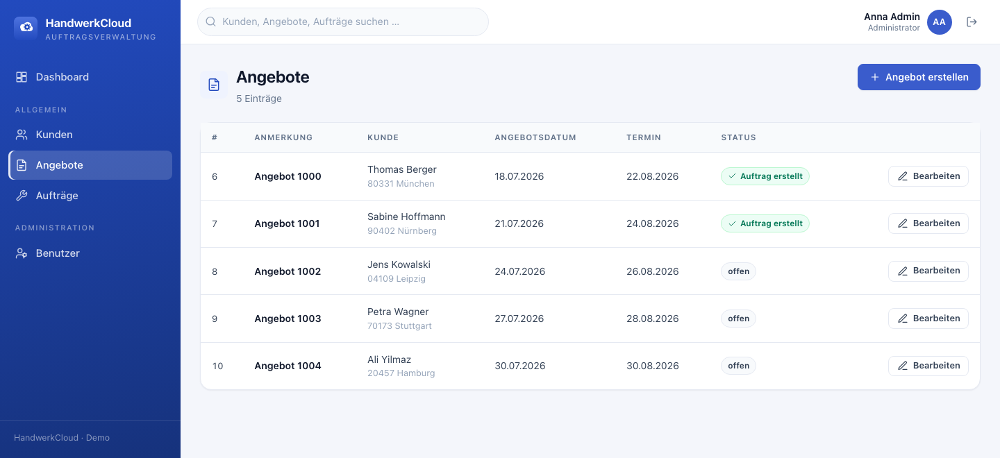
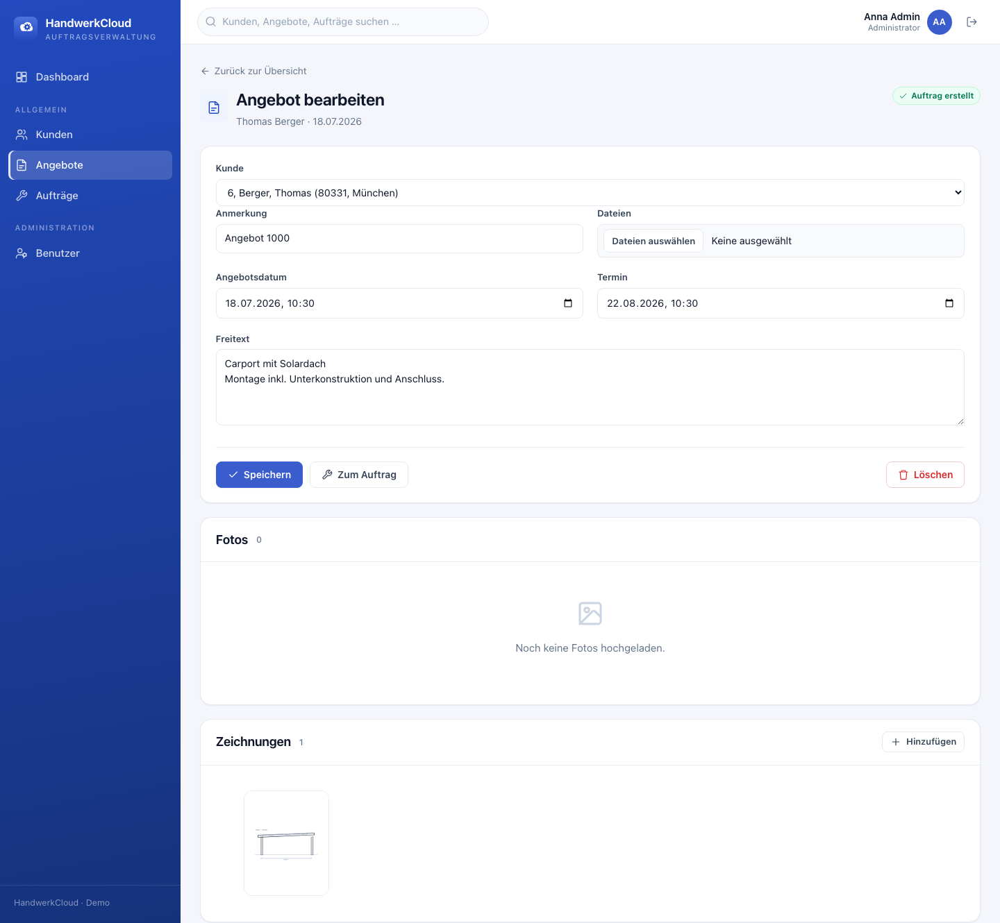
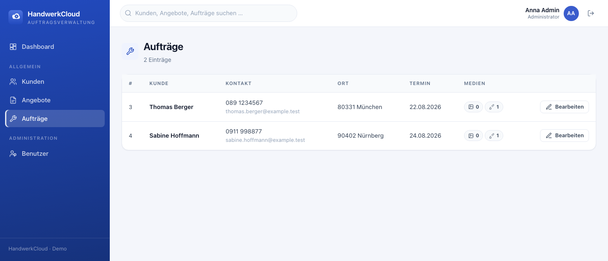
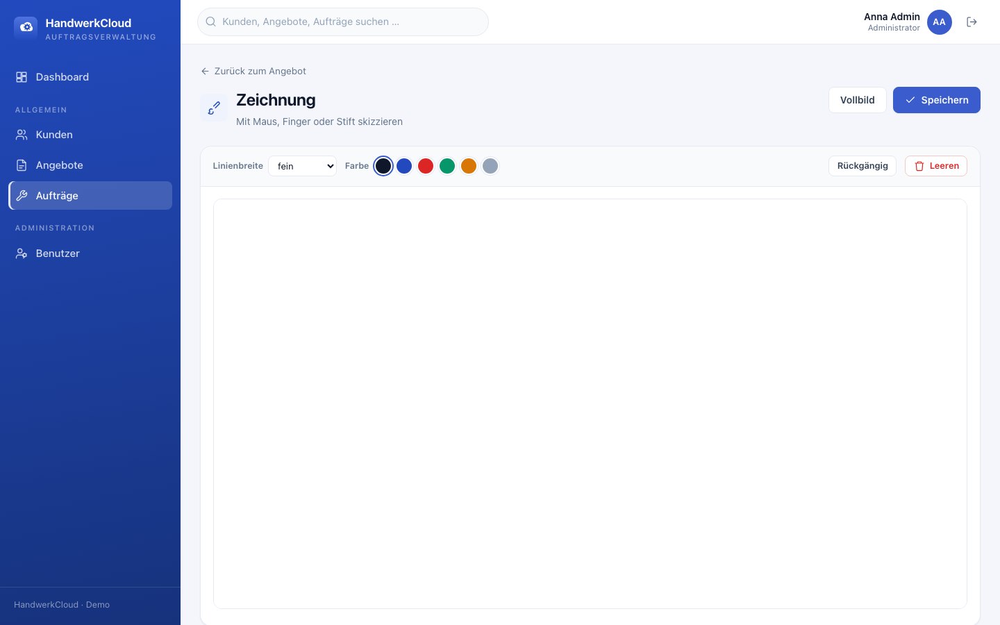

<div align="center">


# HandwerkCloud

**Auftragsverwaltung für Handwerksbetriebe** — a field-service management app that takes a
trade business from customer record to quote to scheduled job, with site photos and
touch-drawn sketches attached along the way.

[](https://github.com/blackburn2601/handwerk-cloud/actions/workflows/ci.yml)


</div>

---

## About

Installers and fitters do their paperwork on a tablet in a van, not at a desk. HandwerkCloud
models that reality: a **customer** gets an **offer** (Angebot); once accepted, the offer is
turned into a **task** (Auftrag) with one click, carrying over the customer, dates, photos and
sketches. On site the fitter photographs the location and sketches the installation directly on
the screen with a finger or stylus.

The interface is entirely in German, because its users are.

> **Note on provenance.** This is a sanitised, self-contained extract of an application I built
> for a client in the solar-carport trade. Client branding, production hostnames and real data
> have been removed and replaced with a neutral identity and generated demo data. The
> architecture, domain model and code are the real thing.

## Screenshots

|  |  |
|:--:|:--:|
|  |  |
| **Login** | **Dashboard** — counts scoped to the signed-in user |
|  |  |
| **Kunden** — customer list | **Angebote** — quotes with job status |
|  |  |
| **Angebot** — quote with media and one-click job creation | **Aufträge** — jobs with attached media |

<div align="center">

<br><em><strong>Zeichnung</strong> — pressure-free canvas sketch pad, usable with finger or stylus</em>
</div>

## Features

- **Customers → Offers → Tasks** with a one-click `Angebot → Auftrag` conversion
- **Photo upload** with MIME validation, attached to an offer and its job simultaneously
- **Canvas sketching** — mouse *and* multi-touch, colour and line-width picker, fullscreen mode
- **Per-record authorization** — users see and touch only what they created; admins see everything
- **Global search** across customers, offers and tasks by name, postcode or city
- **Zip export** of every photo and sketch belonging to a job — what the fitters take to site
- **User administration** with role assignment, behind an admin-only firewall

## Tech stack

| | |
|---|---|
| Runtime | PHP 8.4 · 8.5 |
| Framework | Symfony 7.4 (Twig, Forms, Security, Validator) |
| Persistence | Doctrine ORM 3.x, MySQL 8 |
| Frontend | Twig + a hand-written CSS design system, vanilla JS — no framework, no build step |
| Icons | Inline SVG, no icon font |
| Tests | PHPUnit 11, Symfony BrowserKit |
| CI | GitHub Actions — lint, container/Twig/YAML validation, tests on 8.4 / 8.5 |

## Domain model

```
User ──creates──> Customer ──> Offer ──1:1──> Task
                                 │              │
                                 ├── TaskImage ─┤   uploaded site photos
                                 └── TaskDraw  ─┘   canvas sketches
```

`TaskImage` and `TaskDraw` each carry **both** an `offer` and a `task` relation. When an offer
becomes a job, the same media rows are linked to both sides, so the fitter sees on the job
exactly what was attached to the quote — without duplicating files on disk.

## Points of interest

If you are reading the code to judge it, these are the parts worth your time:

- **[`EntityOwnerVoter`](src/Security/Voter/EntityOwnerVoter.php)** — record-level authorization.
  List pages filter at the repository level; single-record actions go through the voter, so an
  ID in the URL is not enough to reach someone else's data. Images and sketches inherit ownership
  from the offer or task they hang off.
- **[`GlobalSearchController`](src/Controller/GlobalSearchController.php)** — the customer-match
  conditions are grouped into a single `orX` before the ownership restriction is applied. Flat
  `orWhere` chaining here is a classic way to leak other users' rows.
- **[`TaskDrawRenderer`](src/Service/TaskDrawRenderer.php)** — decodes the canvas data URL,
  validates it is really an image, and writes a PNG. Rejects malformed payloads rather than
  handing them to GD.
- **[`TaskImageUploader`](src/Service/TaskImageUploader.php)** — keeps the offer/task media
  relations in sync, and is the only place upload naming and MIME checks happen.
- **[`public/js/TaskDraw.js`](public/js/TaskDraw.js)** — the sketch pad. Pointer Events give
  mouse, touch and stylus a single code path, with undo and a colour picker on top.
- **[`public/css/app.css`](public/css/app.css)** — the design system: custom properties for the
  palette (taken from the logo), then components. No framework underneath it.

## Quick start

Requires PHP ≥ 8.4 with `gd`, `zip`, `intl` and `pdo_mysql`, plus Composer and Docker.

```bash
git clone git@github.com:blackburn2601/handwerk-cloud.git && cd handwerk-cloud
composer install

docker compose up -d                      # MySQL 8 on port 13306
bin/console doctrine:migrations:migrate -n
bin/console doctrine:fixtures:load -n     # demo customers, offers and jobs

symfony server:start                      # or: php -S 127.0.0.1:8000 -t public
```

Then sign in at <http://127.0.0.1:8000/login>:

| Role | E-Mail | Password |
|---|---|---|
| Administrator | `admin@handwerkcloud.test` | `demo1234` |
| Fitter (own records only) | `monteur@handwerkcloud.test` | `demo1234` |

Log in as the fitter to see ownership filtering in action — the demo data is split between the
two accounts.

## Tests

```bash
bin/console doctrine:database:create --env=test
bin/console doctrine:schema:create --env=test

vendor/bin/phpunit                  # 25 tests
vendor/bin/phpunit --testsuite unit # voter + canvas rendering, no database
```

Functional tests rebuild the schema per test and drive the app through real requests, covering
the authorization rules end to end — including the negative cases (a user requesting another
user's record gets a 403, not their data).

## Project layout

```
src/
├── Controller/         thin controllers, one per aggregate
├── Entity/             Doctrine entities with validation constraints
├── Repository/         queries, incl. findByOwner() scoping
├── Form/               Symfony form types (German labels)
├── Security/           form login authenticator + EntityOwnerVoter
├── Service/            upload handling, canvas rendering, zip export
└── DataFixtures/       demo data, incl. a generated sample sketch
templates/
├── _icons.html.twig    inline SVG icon macro
├── form/theme.html.twig  form markup the stylesheet expects
└── …                   one directory per aggregate
public/
├── css/app.css         the design system
└── js/                 app.js (shell) + TaskDraw.js (sketch pad)
tests/
├── Unit/               voter and renderer, no I/O
└── Functional/         real requests against a real database
```

## Notes

The frontend is deliberately dependency-free: no Bootstrap, no jQuery, no icon
font, no bundler. `public/css/app.css` is a small design system of custom
properties, and icons are inline SVG rendered by a Twig macro. That keeps the
repository readable and the payload small, at the cost of writing the components
by hand.

Possible next steps: a dark theme (the palette is already tokenised), Turbo for
snappier navigation, and thumbnailing for uploaded photos.

## License

[MIT](LICENSE)
